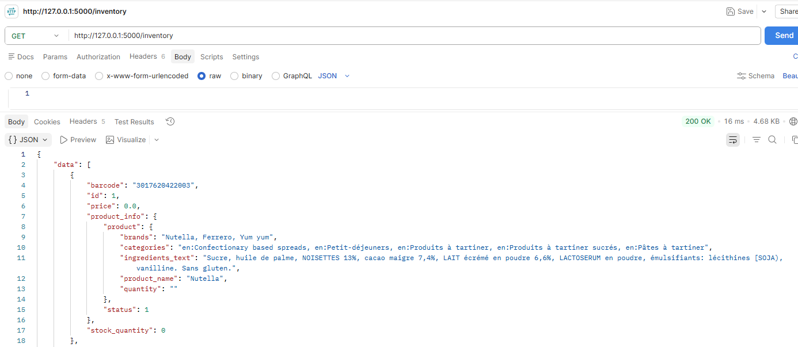

# 🛒 Inventory Management System

## 📋Project Description

This project is an **Inventory Management System** built with **Python,
Flask, and a command-line interface (CLI)**.

The system allows users to manage inventory items through a Flask REST
API and interact with the API through a CLI application. It also
integrates with the **OpenFoodFacts API** to retrieve product
information using a barcode or product name.

Inventory data is stored locally in `data/inventory.py` as a Python list
and is updated when inventory items are added, edited, or deleted.

------------------------------------------------------------------------

## 🚀Project Objectives

The system was developed to provide the following functionality:

-   View all inventory items.
-   Find an inventory item using a barcode.
-   Find a product using its name.
-   Add a new inventory item.
-   Update an item's price or stock quantity.
-   Delete an inventory item.
-   Retrieve product information from OpenFoodFacts.
-   Provide a CLI interface for interacting with the REST API.
-   Test the API, CLI, and external API interactions using `pytest` and
    `unittest.mock`.

------------------------------------------------------------------------

## 🛠️Technologies Used

-   **Python**
-   **Flask** -- REST API
-   **Requests** -- HTTP requests and OpenFoodFacts integration
-   **Pytest** -- automated testing
-   **unittest.mock** -- mocking API responses during testing
-   **OpenFoodFacts API** -- external product information
-   **Git/GitHub** -- version control

------------------------------------------------------------------------

## 📁Project Structure

``` text
INVENTORY-MANAGEMENT/
│
├── data/
│   └── inventory.py
│
├── scripts/
│   └── fetch_products.py
│
├── tests/
│   ├── __init__.py
│   ├── test_api.py
│   ├── test_cli.py
│   └── test_external_api.py
│
├── app.py
├── cli.py
├── README.md
├── Pipfile
└── Pipfile.lock
```

### File Description

  -----------------------------------------------------------------------
  File                                Description
  ----------------------------------- -----------------------------------
  `app.py`                            Contains the Flask application,
                                      REST API routes, inventory
                                      loading/saving functions, product
                                      formatting, and OpenFoodFacts API
                                      integration.

  `cli.py`                            Contains the command-line interface
                                      used to interact with the Flask
                                      API.

  `data/inventory.py`                 Contains the simulated inventory
                                      database as a Python list.

  `scripts/fetch_products.py`         Supporting product-fetching script
                                      included in the project.

  `tests/test_api.py`                 Tests the Flask inventory API
                                      endpoints.

  `tests/test_cli.py`                 Tests CLI commands and
                                      interactions.

  `tests/test_external_api.py`        Tests interactions with the
                                      OpenFoodFacts API.

  `README`                            Document project details.

  `Pipfile`                           Python dependency configuration.

  `Pipfile.lock`                      Locked dependency versions.
  -----------------------------------------------------------------------

------------------------------------------------------------------------

# 📦Inventory Data

The inventory is stored in:
``` text
data/inventory.py
```

The data is represented as a Python list:

``` python
inventory = [
    {
        "id": 2,
        "barcode": "737628064502",
        "price": 0.0,
        "stock_quantity": 0,
        "product_info": {
            "status": 1,
            "product": {
                "product_name": "Thai peanut noodle kit includes stir-fry rice noodles & thai peanut seasoning",
                "brands": "Simply Asia, Thai Kitchen",
                "ingredients_text": "Rice Noodles (rice, water), seasoning packet (peanut, sugar, salt, corn starch, spices [chili, cinnamon, pepper, cumin, clove], hydrolyzed soy protein, green onions, citric acid, peanut oil, sesame oil, natural flavor).",
                "quantity": "155 g",
                "categories": "Cereals and their products, Noodles, Rice Noodles"
            }
        }
    }
]
```

Each inventory item contains a unique inventory ID, barcode, price,
stock quantity, and product information.

The application updates the inventory list when products are added,
updated, or deleted.

🌐 ## CLI Application

The CLI provides a simple menu for employees to interact with the
inventory system.

Run:

``` bash
python cli.py
```

The menu provides:

``` text
1. View all items in the inventory
2. Fetch for a single product by barcode
3. Fetch for a single product by name
4. Add a new item to the inventory
5. Update an existing item in the inventory
6. Delete an item from the inventory
7. Exit the program
```

The CLI communicates with the Flask application using HTTP requests
rather than directly modifying the inventory data.

## ⚙️Installation

### 1. Clone the repository

``` bash
git clone https://github.com/KayteNjeri/inventory-management-system-api-with-flask
cd inventory-management-system-api-with-flask
```

### 2. Confirm Python installation

``` bash
python --version
```

### 3. Install dependencies

If using Pipenv:

``` bash
pipenv install
```

To install the main packages directly:

``` bash
pip install flask requests pytest
```

## ▶️Running the Application

Start the Flask API:

``` bash
python app.py
```

The API will run at:

``` text
http://127.0.0.1:5000
```

Keep the Flask server running while using the CLI.

In another terminal, run:

``` bash
python cli.py
```

## Running the Tests

The project uses `pytest` for automated testing.

Run the complete test suite:

``` bash
pytest
```

The test suite covers:

### API Endpoint Tests

-   GET inventory
-   GET individual inventory item
-   POST inventory item
-   PATCH inventory item
-   DELETE inventory item
-   Error responses

### CLI Tests

-   Viewing inventory
-   Searching by barcode
-   Searching by product name
-   Adding products
-   Updating products
-   Deleting products
-   Error handling

### External API Tests

-   Successful OpenFoodFacts response
-   Product not found
-   Connection failure

`unittest.mock` is used to simulate API responses so that unit tests do
not depend on live external API calls.

## 🔗API Endpoint Summary

  ----------------------------------------------------------------------------------
  Method                  Endpoint                           Description
  ----------------------- ---------------------------------- -----------------------
  GET                     `/inventory`                       Fetch all inventory
                                                             items

  GET                     `/inventory/<id>`                  Fetch an item by
                                                             barcode

  GET                     `/inventory/name/<product_name>`   Search for an item by
                                                             product name

  POST                    `/inventory`                       Add a new inventory
                                                             item

  PATCH                   `/inventory/<id>`                  Update price or stock
                                                             quantity

  DELETE                  `/inventory/<id>`                  Delete an inventory
                                                             item
  ----------------------------------------------------------------------------------

## ❗Error Handling

The application handles common errors including:

-   Missing required POST fields.
-   Duplicate product barcodes.
-   Product not found.
-   Invalid inventory items.
-   OpenFoodFacts connection failures.
-   Invalid CLI input.
-   API connection failures from the CLI.

Appropriate HTTP status codes are returned by the Flask API, including:

``` text
200 OK
201 Created
400 Bad Request
404 Not Found
500 Internal Server Error
```

## 🧪 Testing with Postman

The Flask API can be tested using Postman.

Recommended requests to validate the application:

1.  `GET /inventory`

2.  `GET /inventory/<barcode>`
3.  `GET /inventory/name/<product_name>`
4.  `POST /inventory`
5.  `PATCH /inventory/<barcode>`
6.  `DELETE /inventory/<barcode>`

Flask debug mode is enabled during local development to assist with
debugging.


## 🔮Future Improvements

Possible future improvements include:

-   Migrating from simulated Python-list storage to a relational
    database.
-   Adding authentication.
-   Adding inventory categories and suppliers.
-   Adding pagination and advanced product search.
-   Adding a web-based frontend.
-   Migrating external API integration to newer OpenFoodFacts API
    functionality where appropriate.

## 👩🏽‍💻Author

**Inventory Management System**

Developed as part of Python REST API with Flask assessment project to demonstrate backend dveleopment concepts and practices.

## 📄License

This project is licensed under MIT Licence.